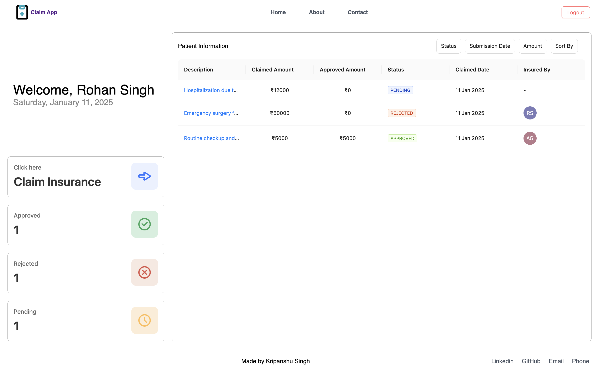
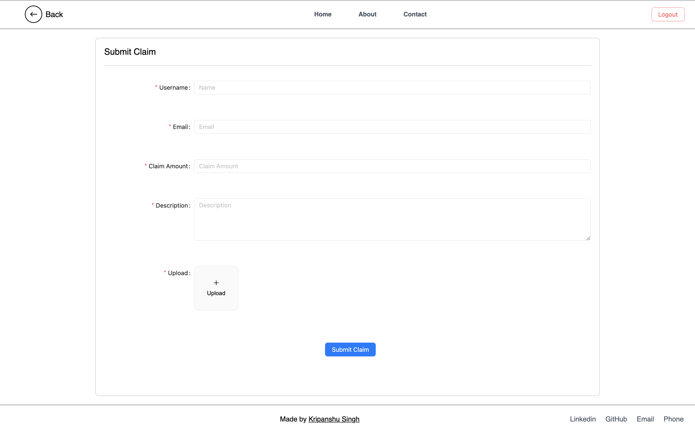
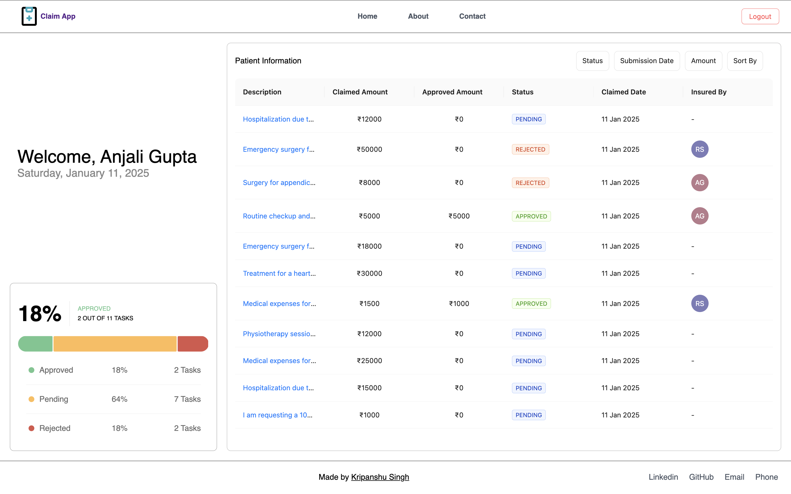

# Claim App

## Overview

The **Claim App** is a web application designed to simplify and streamline claim management for both patients and insurers. It includes two separate portals: one for patients to submit and track claims and another for insurers to review and manage claims. The project is built using modern web technologies and follows the requirements outlined in the assignment.

## Features

### Patient Side

- **Submit a Claim**:
  - A form to capture:
    - Name
    - Email
    - Claim Amount
    - Description
    - Upload a document (e.g., receipt or prescription).
  - Documents are uploaded to `Cloudinary`.
- **View Claims**:
  - A dashboard displaying submitted claims with:
    - Status (Pending, Approved, Rejected).
    - Submission Date.
    - Approved Amount (if applicable).
  - Filters and Sorting:
    - Filters: Status, Start Date, End Date, Minimum Amount, Maximum Amount.
    - Sort by: Claim Amount, Date.

### Insurer Side

- **Claims Dashboard**:
  - View all submitted claims with the ability to filter and sort by:
    - Status (Pending, Approved, Rejected).
    - Date.
    - Claim Amount.
- **Manage Claims**:
  - A panel to:
    - View claim details and uploaded documents.
    - Update claim status (Approve/Reject).
    - Leave comments and set the approved amount.

### Shared Features

- **Authentication**:
  - Basic login for patients and insurers using JWT (access token and refresh token).
- **API Development**:
  - Endpoints for submitting, fetching, and updating claims.
- **Database**:
  - Claims are stored with fields:
    - ID, Name, Email, Claim Amount, Approved Amount, Description, Status, Submission Date, and Insurer Comments.

---

## Tech Stack

### Frontend

- **React.js**: For building the user interface.
- **Ant Design (AntD)**: For UI components and styling.
- **Deployed on Vercel**: For hosting the frontend.

### Backend

- **Node.js**: Backend runtime.
- **Express.js**: Backend framework for API development.
- **MongoDB**: For database storage of claims.
- **Cloudinary**: For managing uploaded documents.
- **Authentication**: JWT (access token and refresh token).
- **Deployed on Render**: For hosting the backend.

---

## Usage

### Patient Dashboard

- Access the patient dashboard to view and manage claims.
- Use filters and sorting options for an optimized experience.
- Submit a new claim using the `Submit Claim` form.

### Insurer Dashboard

- View all submitted claims in the insurer dashboard.
- Filter and sort claims based on status, date, and claim amount.
- Update claim statuses, leave comments, and set approved amounts.

---

## Screenshots

### Patient Dashboard

### Claim Submission Form

### Insurer Dashboard

---

## API Endpoints

### Authentication

- `POST /api/auth/login`: Authenticate user and generate access and refresh tokens.
- `POST /api/auth/refresh`: Refresh access token using refresh token.

### Claims

- `POST /api/claims`: Submit a new claim.
- `GET /api/claims`: Fetch claims with filtering and sorting options.
- `PUT /api/claims/:id`: Update claim status, comments, and approved amount.

---

## Deployment

The application is deployed as follows:

- **Frontend**: Hosted on Vercel.
- **Backend**: Deployed using a Node.js server (hosted on Render).

---

## GitHub Repository

Find the source code here:
[Claim Management GitHub Repository](https://github.com/kripanshu-singh/claim-management)

---

## Evaluation

This project meets the following criteria:

- Core functionality is implemented for both patients and insurers.
- Simple and efficient design.
- Well-structured and maintainable code.
- Complete deliverables with proper documentation.

---

## License

This project is licensed under the MIT License.

---

## Contact

For any questions or feedback, please contact:

- **Developer**: Kripanshu Singh
- **Email**: [kripanshusingh160305@gmail.com]

---

Thank you for reviewing my project!
